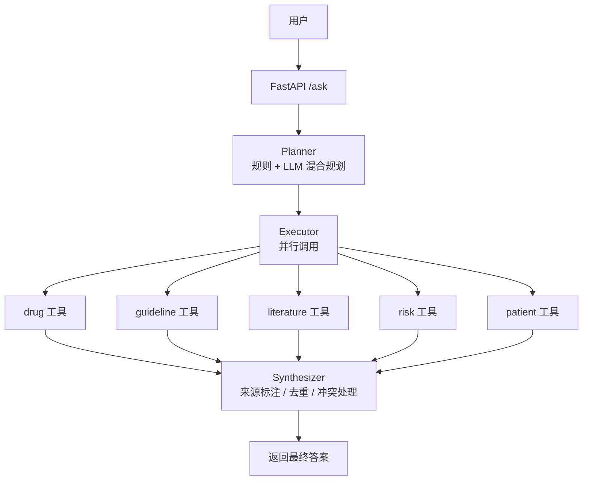
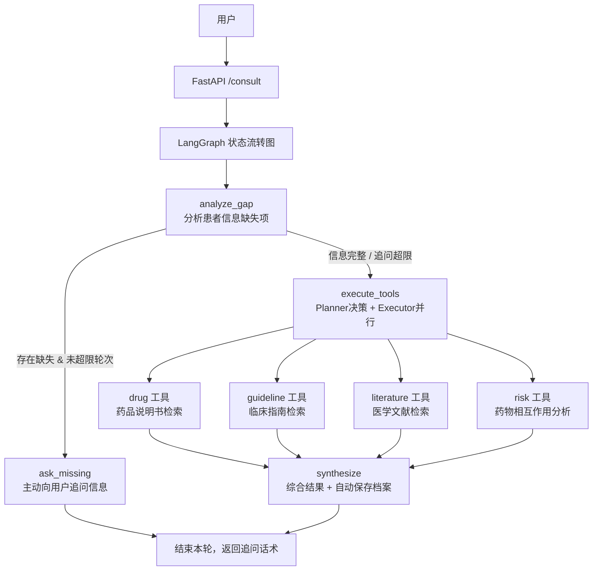
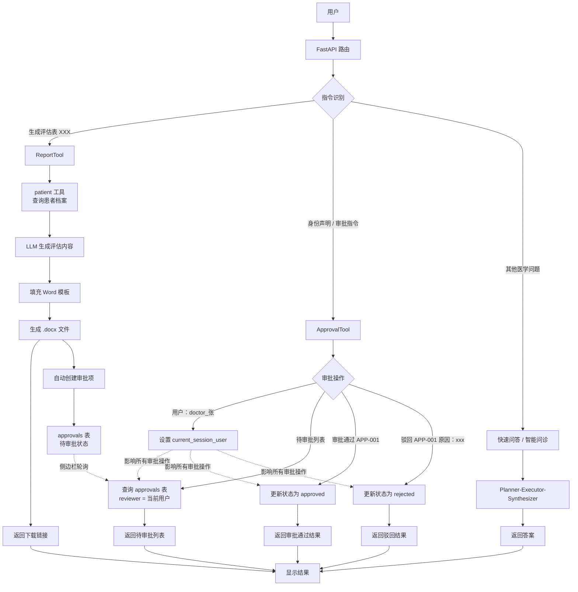
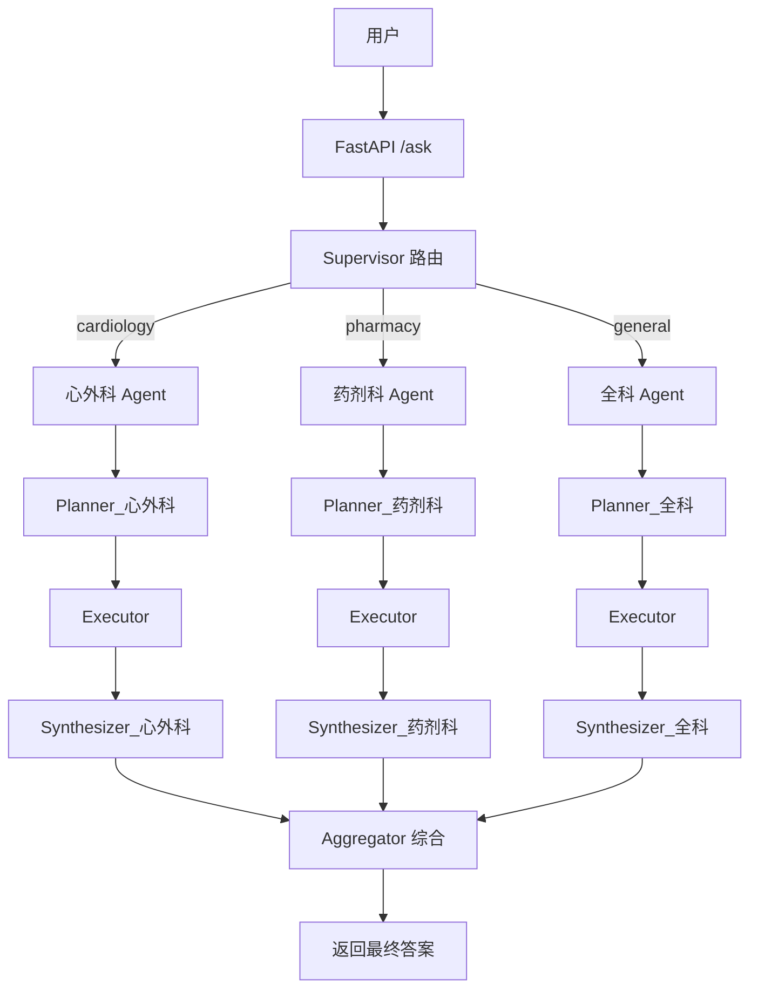

# 基于RAG+LangGraph的多Agent协作医学问答平台

## 项目简介

本项目是一个基于 **LangChain + FastAPI + Chroma** 构建的医疗领域智能问答 Agent。系统采用 **Planner-Executor-Synthesizer** 三层架构，能够并行调用药物、指南、文献、风险、患者档案等多个专业工具，提供准确、可溯源的医学信息回答。

> **V2 新增特性**：基于 LangGraph 实现多轮交互式智能问诊，主动提取并追问患者缺失信息（年龄、过敏史、用药史），生成个性化用药建议。

> **V3 新特性**：多租户隔离 + 自动审批闭环。支持不同租户（医院/科室）数据隔离，对话驱动的审批管理，评估表生成后自动创建审批项，侧边栏实时展示待审批列表。

> **V4 新特性**：多 Agent 协作（Supervisor + 心外科/药剂科/全科 Agent 并行执行）、单元测试全覆盖、数据回流

## 技术栈

| 组件 | 技术 |
|------|------|
| Web 框架 | FastAPI + Uvicorn |
| LLM 服务 | 阿里云 DashScope (qwen-plus) |
| 嵌入模型 | text-embedding-v4 |
| 向量数据库 | Chroma (本地) |
| 关系数据库 | MySQL 8.0 |
| Agent 框架 | LangChain + LangGraph |
| 容器化 | Docker + Docker Compose |
| 监控 | Prometheus (指标暴露) |
| 日志 | RotatingFileHandler (日志轮转) |
| 测试 | pytest + pytest-asyncio + pytest-cov |

## 核心功能

| 功能 | 描述 |
|------|------|
| **多工具协同问答** | 同时调用 drug/guideline/literature/risk 工具回答复杂医学问题 |
| **LangGraph 智能问诊(V2)** | 多轮对话自动分析信息缺口，主动追问年龄、过敏史、用药史 |
| **患者档案管理** | 记住、查询、追加患者信息，自动加载档案辅助个性化决策 |
| **LLM 信息自动抽取** | 从自然对话提取年龄、过敏史、既往用药史，自动归档患者信息 |
| **多轮对话记忆** | 理解“它”、“他”、“这个”等指代词，连贯承接上下文对话 |
| **智能规划器** | 规则 + LLM 混合规划，自动选择最优工具调用组合 |
| **并行执行** | 多工具并发调用，整体响应耗时缩短约 70% |
| **缓存优化** | 重复问题结果缓存，减少冗余 LLM 调用成本 |
| **流式输出** | 支持 SSE 逐字流式返回，优化前端交互体验 |
| **重试降级** | 接口调用异常自动重试，失败兜底返回检索原文片段 |
| **监控运维** | Prometheus 指标采集 + 日志轮转 + 服务健康检测 |
| **诊疗评估表生成** | 依托患者档案+Word模板自动生成评估文档，支持下载 |
| **多租户隔离（V3）** | 患者档案和审批数据按租户隔离，支持多团队共用 |
| **自动审批（V3）** | 评估表生成后自动创建审批项，对话驱动审批流转 |
| **文件图内容识别（V3）** | 支持文件和图片上传后识别内容，支持多文件上传 |
| **会话历史持久化（V3）** | 支持浏览器刷新或重新登录后保留历史会话信息 | 
| **快速问答增加推理可视化（V3）** | 支持对话窗口查看问题回答的推理过程（未持久化保存）| 
| **优化rag问答逻辑，提升检索准确率和召回率（V3）** | 查询改写(LLM生成多角度查询) + 混合检索(向量+BM25) + 重排序 | 
| **待审批列表查看详情（V3）** | 审批助手页面，待审批列表可以单击后查看详情 | 
| **评估表在线预览功能（V3）** | 智能问诊对话中，增加评估表的在线预览 |
| **历史会话管理功能（V3）** | 增加多对话能力，每个会话内容各自保存，支持新建和删除对话 |
| **支持用户隔离（V3）** | 智能问诊支持用户隔离，不同的医生登录，只能查看和编辑各自名下的病人信息 |
| **日志和数据库中关键信息加密（V3）** | 对患者的身份证号和手机号做加密展示 |
| **支持对接本地模型，并支持切换（V3）** | 从环境变量修改是本地模型还是云端API |
| **多Agent协同（V4）** | 独立出全科、心外科、药剂科三个agent，对接在快速对话窗口 |
| **对接飞书（V4）** | 可对接至飞书，在飞书中进行问答 |
| **同对话框话题切换（V4）** | 识别当前问题和历史问题的相关性，避免历史问答干扰 |
| **数据回流（V4）** | 历史对话数据回流，供新的患者用药参考 |

## 架构图

## V2 LangGraph 交互式问诊架构

## V3多租户 + 自动审批架构



### V4 多 Agent 协作架构


## 快速开始

### 1. 环境要求
- Python 3.10+
- Docker + Docker Compose (可选)
- 阿里云 DashScope API Key

### 2. 克隆项目
- git clone https://github.com/Dillon-Xue/med_agent_v1.git
- cd med_agent_v1

### 3. 配置环境变量

复制 `.env.example` 为 `.env` 并填写：

```bash
cp .env.example .env
```

编辑 `.env` 文件：

```env
# ============================================
# 阿里云 DashScope 配置
# ============================================
DASHSCOPE_API_KEY=sk-xxxxxxxxxxxxxxxxxxxxxxxx   # 你的百炼 API Key
DASHSCOPE_MODEL=text-embedding-v4               # 嵌入模型

# ============================================
# 项目路径配置
# ============================================
MED_AGENT_ROOT=/mnt/d/Agent/Med_Agent   # 向量库所在目录（本地运行）
# MED_AGENT_ROOT=/app                           # Docker 容器内使用

# ============================================
# LLM 模型配置
# ============================================
LLM_MODEL_NAME=qwen-plus                        # 对话模型
EMBEDDING_MODEL_NAME=text-embedding-v4          # 嵌入模型

# ============================================
# MySQL 数据库配置（患者档案存储）
# ============================================
DB_HOST=localhost                               # 数据库地址
DB_USER=root                                    # 数据库用户名
DB_PASSWORD=your_strong_password                # 数据库密码
DB_NAME=patient_db                              # 数据库名称

# ============================================
# 模型切换
# ============================================
OLLAMA_MODEL=qwen2.5:3b                         # 本地模型
LLM_PROVIDER=dashscope                          # 本地和云上二选一
#LLM_PROVIDER=ollama

LOG_LEVEL=INFO                                  # 或DEBUG 开启调试日志
# ============================================
#对接飞书配置，飞书上机器人的应用信息
# ============================================
FEISHU_APP_ID=cli_aa#########bcb
FEISHU_APP_SECRET=zM6WGA#############gxKq2YJq
FEISHU_VERIFICATION_TOKEN=e###########3BQ2
```

### 4. 配置向量库
#### 需要先将医药相关的PDF文档放入 data/{drug,guideline,literature,risk} 目录
python ingest.py

### 5. 启动服务
- 方式一：直接运行
pip install -r requirements.txt
uvicorn chat:app --reload

- 方式二：Docker 一键启动
docker-compose up -d

### 6. 访问前端
- 问答页面 http://localhost:8000/static/index.html 
- 接口文档 http://localhost:8000/docs  
- 状态检查 http://localhost:8000/health   
- 监控信息 http://localhost:8000/metrics   

### 7. 运行测试
#### 本地运行单元测试
PYTHONPATH=. pytest tests/ -v

#### 查看覆盖率
PYTHONPATH=. pytest tests/ --cov=agents --cov=tools --cov-report=html

#### 容器内运行
docker exec med_agent bash -c "cd /app && PYTHONPATH=. pytest tests/ -v"

# 项目结构说明
```tree
med_agent_v1/
├── agents/
│   ├── planner.py           # 规则+LLM混合规划
│   ├── executor.py          # 异步并行执行
│   ├── synthesizer.py       # LLM答案合成
│   ├── consult_graph.py     # LangGraph智能问诊
│   ├── supervisor.py        # 多Agent路由
│   ├── agent_factory.py     # 科室Agent工厂
│   ├── aggregator.py        # 多Agent结果综合
│   └── state.py             # LangGraph状态定义
├── tools/
│   ├── base_tool.py         # 工具基类（重试+降级）
│   ├── drug_tool.py         # 药品说明书检索
│   ├── guideline_tool.py    # 临床指南检索
│   ├── literature_tool.py   # 医学文献检索
│   ├── risk_tool.py         # 药物相互作用检索
│   ├── patient_tool.py      # 患者档案CRUD
│   ├── report_tool.py       # 评估表生成+审批
│   ├── approval_tool.py     # 审批管理
│   ├── file_tool.py         # 文件解析
│   ├── retriever.py         # 混合检索（向量+BM25）
│   ├── memory_tool.py       # L4语义记忆（V4.1）
│   └── tool_registry.py     # 工具注册表
├── utils/
│   ├── config.py            # LLM客户端工厂
│   ├── embeddings.py        # DashScope嵌入
│   ├── response.py          # 统一响应格式
│   ├── crypto.py            # 敏感数据加密
│   └── audit.py             # 审计日志
├── tests/                   # 单元测试
│   ├── conftest.py          # Mock夹具
│   ├── test_planner.py      # 18个用例
│   ├── test_executor.py     # 4个用例
│   ├── test_synthesizer.py  # 7个用例
│   ├── test_retriever.py    # 4个用例
│   └── test_base_tool.py    # 重试降级用例
├── static/
│   └── index.html           # 前端SPA
├── feishu_adapter.py        # 飞书适配层（V4.0.1）
├── chat.py                  # FastAPI主入口
├── ingest.py                # 向量库构建
├── init.sql                 # 数据库建表
├── dockerfile               # 集成测试
├── docker-compose.yml
├── requirements.txt         # 含pytest依赖
└── README.md
```

# 待完善事项
- 真实权限管理（RBAC）
- LLM 权限隔离
