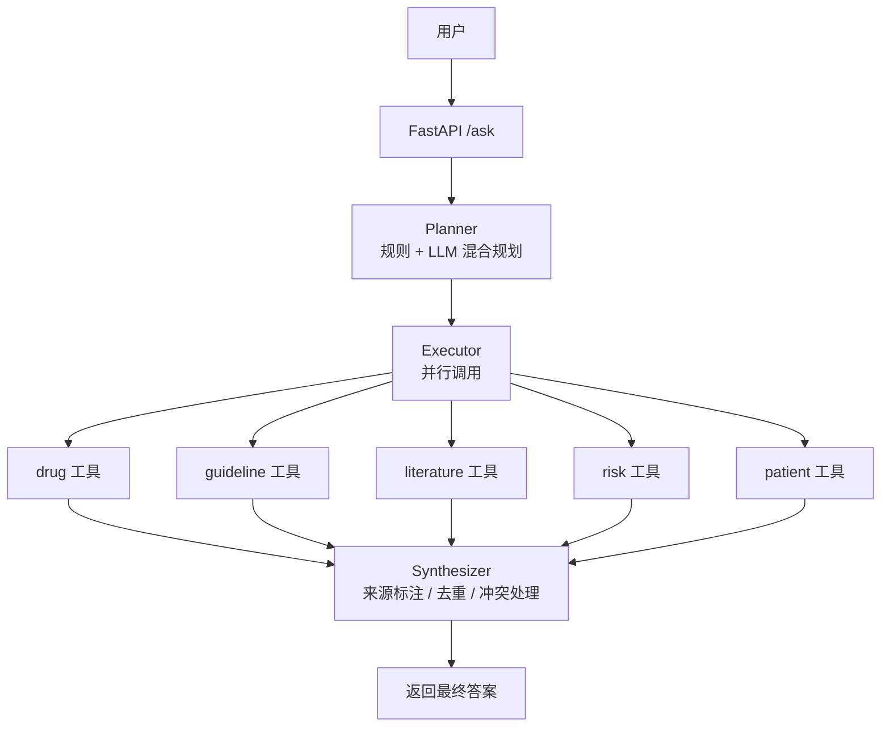
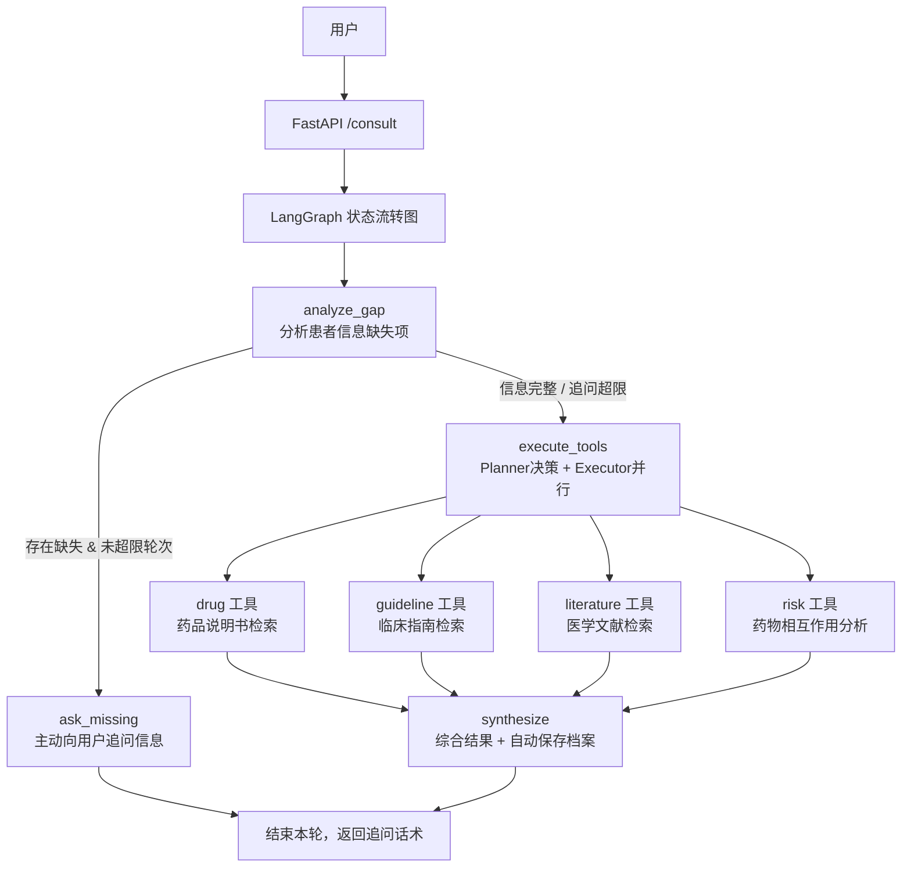
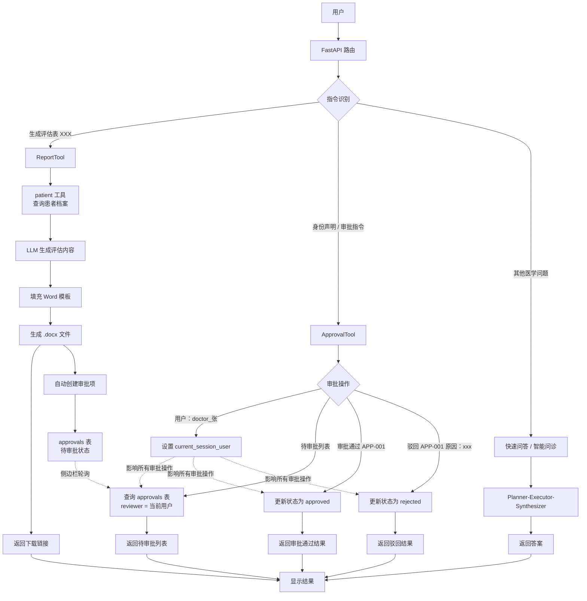

# 医疗 Agent — 基于 RAG 的多工具医学问答助手

## 项目简介

本项目是一个基于 **LangChain + FastAPI + Chroma** 构建的医疗领域智能问答 Agent。系统采用 **Planner-Executor-Synthesizer** 三层架构，能够并行调用药物、指南、文献、风险、患者档案等多个专业工具，提供准确、可溯源的医学信息回答。

> **V2 新增特性**：基于 LangGraph 实现多轮交互式智能问诊，主动提取并追问患者缺失信息（年龄、过敏史、用药史），生成个性化用药建议。

> ****V3 新特性**：多租户隔离 + 自动审批闭环。支持不同租户（医院/科室）数据隔离，对话驱动的审批管理，评估表生成后自动创建审批项，侧边栏实时展示待审批列表。

## 技术栈

| 组件 | 技术 |
|------|------|
| Web 框架 | FastAPI + Uvicorn |
| LLM 服务 | 阿里云 DashScope (qwen-plus) |
| 嵌入模型 | text-embedding-v4 |
| 向量数据库 | Chroma (本地) |
| 关系数据库 | MySQL 8.0 |
| Agent 框架 | LangChain |
| 容器化 | Docker + Docker Compose |
| 监控 | Prometheus (指标暴露) |
| 日志 | RotatingFileHandler (日志轮转) |

## 核心功能

| 功能 | 描述 |
|------|------|
| **多工具协同问答** | 同时调用 drug/guideline/literature/risk 工具回答复杂医学问题 |
| **LangGraph 智能问诊(V2)** | 多轮对话自动分析信息缺口，主动追问年龄、过敏史、用药史 |
| **患者档案管理** | 记住、查询、追加患者信息，自动加载档案辅助个性化决策 |
| **LLM 信息自动抽取** | 从自然对话提取年龄、过敏史、既往用药史，自动归档患者信息 |
| **多轮对话记忆** | 理解“它”、“他”、“这个”等指代词，连贯承接上下文对话 |
| **智能规划器** | 规则 + LLM 混合规划，自动选择最优工具调用组合 |
| **并行执行** | 多工具并发调用，整体响应耗时缩短约 70% |
| **缓存优化** | 重复问题结果缓存，减少冗余 LLM 调用成本 |
| **流式输出** | 支持 SSE 逐字流式返回，优化前端交互体验 |
| **重试降级** | 接口调用异常自动重试，失败兜底返回检索原文片段 |
| **监控运维** | Prometheus 指标采集 + 日志轮转 + 服务健康检测 |
| **诊疗评估表生成** | 依托患者档案+Word模板自动生成评估文档，支持下载 |
| **多租户隔离（V3）** | 患者档案和审批数据按租户隔离，支持多团队共用 |
| **自动审批（V3）** | 评估表生成后自动创建审批项，对话驱动审批流转 |
| **文件图内容识别（V3）** | 支持文件和图片上传后识别内容 |


## 架构图

## V2 LangGraph 交互式问诊架构

## V3多租户 + 自动审批架构



## 快速开始

### 1. 环境要求
- Python 3.10+
- Docker + Docker Compose (可选)
- 阿里云 DashScope API Key

### 2. 克隆项目
- git clone https://github.com/Dillon-Xue/med_agent_v1.git
- cd med_agent_v1

### 3. 配置环境变量

复制 `.env.example` 为 `.env` 并填写：

```bash
cp .env.example .env
```

编辑 `.env` 文件：

```env
# ============================================
# 阿里云 DashScope 配置
# ============================================
DASHSCOPE_API_KEY=sk-xxxxxxxxxxxxxxxxxxxxxxxx   # 你的百炼 API Key
DASHSCOPE_MODEL=text-embedding-v4               # 嵌入模型

# ============================================
# 项目路径配置
# ============================================
MED_AGENT_ROOT=/mnt/d/Agent/Med_Agent   # 向量库所在目录（本地运行）
# MED_AGENT_ROOT=/app                           # Docker 容器内使用

# ============================================
# LLM 模型配置
# ============================================
LLM_MODEL_NAME=qwen-plus                        # 对话模型
EMBEDDING_MODEL_NAME=text-embedding-v4          # 嵌入模型

# ============================================
# MySQL 数据库配置（患者档案存储）
# ============================================
DB_HOST=localhost                               # 数据库地址
DB_USER=root                                    # 数据库用户名
DB_PASSWORD=your_strong_password                # 数据库密码
DB_NAME=patient_db                              # 数据库名称
```

### 4. 配置向量库
#### 需要先将医药相关的PDF文档放入 data/{drug,guideline,literature,risk} 目录
python ingest.py

### 5. 启动服务
- 方式一：直接运行
pip install -r requirements.txt
uvicorn chat:app --reload

- 方式二：Docker 一键启动
docker-compose up -d

### 6. 访问前端
- 问答页面 http://localhost:8000/static/index.html 
- 接口文档 http://localhost:8000/docs  
- 状态检查 http://localhost:8000/health   
- 监控信息 http://localhost:8000/metrics   

# 项目结构说明

## 核心模块说明

### 1. `agents/` — Agent 核心逻辑

| 文件 | 职责 |
|------|------|
| `planner.py` | 决定调用哪些工具。支持规则匹配（关键词）+ LLM 混合规划，返回工具列表。 |
| `executor.py` | 并行执行多个工具（使用 `asyncio.gather`），每个工具设置 10 秒超时，过滤 `None` 结果。 |
| `synthesizer.py` | 综合多个工具返回的结果，进行来源标注、去重、冲突处理，调用 LLM 生成最终答案。 |
| `llm_planner.py` | 当规则匹配结果不理想时（0 个或超过 3 个工具），调用 qwen-plus 重新生成工具列表。 |
| `consult_graph.py` | LangGraph 智能问诊图，包含 `analyze_gap` → `ask_missing` → `execute_tools` → `synthesize` 节点。 |
| `state.py` | LangGraph 状态定义（问题、历史、患者信息、缺失信息、工具结果、迭代次数等）。 |


### 2. `tools/` — 工具实现

| 文件 | 职责 |
|------|------|
| `base_tool.py` | 抽象基类。定义 `run` 接口，加载 Chroma 向量库，初始化 OpenAI 客户端，提供 `_safe_llm_call`（重试 + 降级）。 |
| `drug_tool.py` | 检索药品说明书向量库，回答成分、适应症、副作用、用法用量等。 |
| `guideline_tool.py` | 检索临床指南向量库，回答治疗推荐、诊疗规范等。 |
| `literature_tool.py` | 检索医学文献向量库，回答机制研究、最新进展等。 |
| `risk_tool.py` | 检索药物相互作用向量库，回答不良反应、禁忌症、药物冲突等。 |
| `patient_tool.py` | 管理患者档案（记住 / 查询 / 追加），使用 MySQL 存储，支持身份证号唯一标识。 |
| `report_tool.py` | 基于患者档案 + Word 模板生成评估表，调用 LLM 生成评估内容，返回下载链接。**同时自动创建审批项**。 |
| `approval_tool.py` | 审批管理（创建 / 待审批列表 / 已通过 / 已驳回 / 全部列表 / 通过 / 驳回）。支持多租户隔离。 |
| `rag_tool.py` | 通用 RAG 工具（备用），包含 query rewrite + 检索 + rerank。 |
| `tool_registry.py` | 统一创建和管理所有工具实例，对外提供 `get_tools()` 接口。 |
| `file_tool.py` | 页面文件上传 |


### 3. `utils/` — 工具函数

| 文件 | 职责 |
|------|------|
| `config.py` | 从 `.env` 读取配置（LLM 模型名、嵌入模型名等）。 |
| `embeddings.py` | 封装 DashScope `text-embedding-v4` 模型，实现 `embed_documents` 和 `embed_query` 方法。 |
| `response.py` | 定义 `build_response` 函数，确保所有工具返回统一的 JSON 结构（含 answer、source、debug、trace）。 |


### 4. `static/` — 前端资源

| 文件 | 职责 |
|------|------|
| `index.html` | 单页聊天界面，包含三个独立模块（快速问答、智能问诊、审批助手），对话历史各自隔离，侧边栏展示审批列表。 |


### 5. 根目录关键文件

| 文件 | 职责 |
|------|------|
| `chat.py` | FastAPI 主入口。定义 `/ask`、`/consult`、`/approvals`、`/health`、`/metrics` 等端点。集成租户中间件、身份声明、审批/患者操作拦截。 |
| `ingest.py` | 从 `data/` 目录读取 PDF 文档，切片后存入 Chroma 向量数据库。支持分类：drug、guideline、literature、risk、rag。 |
| `init.sql` | 数据库初始化脚本（建表 + 字段添加），MySQL 容器首次启动时自动执行。 |
| `dockerfile` | Docker 镜像构建文件（Python 3.10-slim + 依赖安装 + 代码复制 + 启动命令）。 |
| `docker-compose.yml` | 定义 `med_agent` 和 `mysql-patient` 两个服务，配置端口映射、环境变量、数据卷挂载。 |
| `.env` | 环境变量（API Key、数据库密码、路径配置等），不提交 Git。 |
| `.env.example` | 环境变量示例模板（提交 Git）。 |