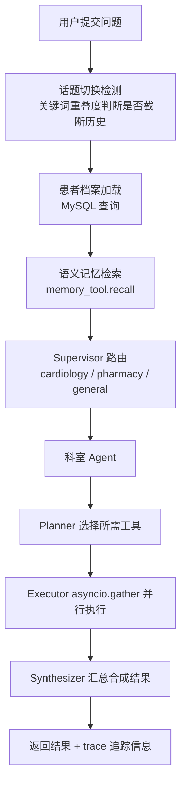
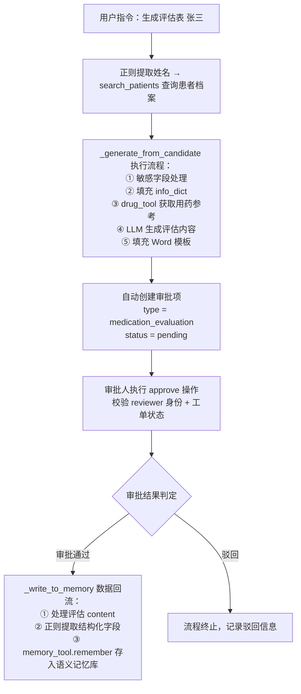
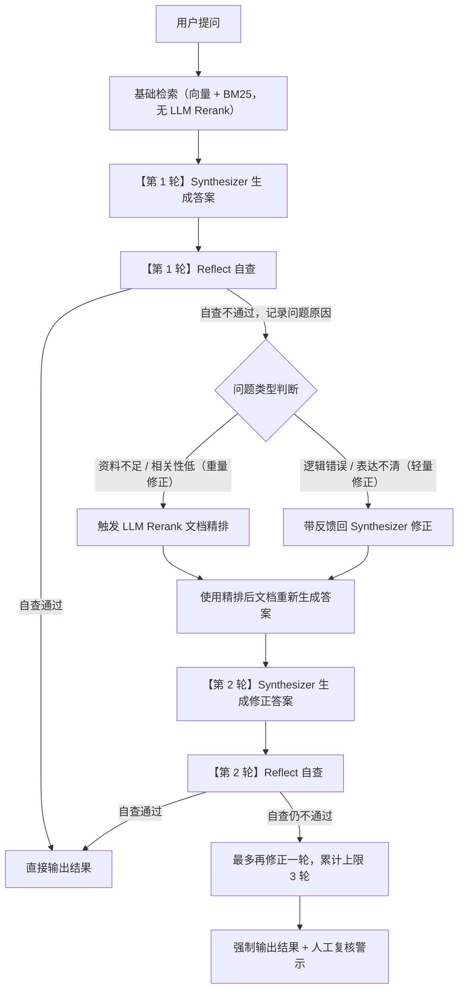

# Med Agent 智能医疗辅助平台

> 一个能查药、问诊、生成用药评估表、在线方案评审的智能医学平台

---

## 第一篇：背景概述

### 1.1 场景描述

门诊用药决策中，最消耗医生时间、最容易出风险的，往往不是常见病，而是那些**现有系统回答不了的问题**。当医生面对以下场景时，HIS 和药品系统通常只能给出基础信息，真正的判断必须靠医生自己跨库查询、人工核对：

**场景一：罕见病与孤儿药**

一名内分泌科医生接诊罕见病患者，需要用到院内极少使用的孤儿药。医院药品知识库几乎没有相关条目，医生只能去 PubMed、UpToDate、药典附录里逐篇检索，还要手动核对剂量和适应证。

**场景二：新药或刚纳入医保的药品**

一种抗肿瘤靶向药刚获批上市，院内系统还没来得及录入完整说明书；或者某药品新适应证刚纳入医保，但旧版指南尚未更新。医生需要同时查最新文献、说明书增补和医保目录，才能给出稳妥处方。

**场景三：超说明书用药**

风湿免疫科想为一位难治性患者使用某药的超说明书用法。现有系统只会标红"超说明书"，但不会告诉医生：有没有指南支持？国内外有没有类似案例？剂量怎么调整？

**场景四：非常见多药联用**

一位老年患者同时患有心衰、肾功能不全和痛风，需要联用多种药物。这些药物单独看都安全，但组合后的相互作用、代谢负担和剂量调整，在常规药品系统里没有现成答案。

**场景五：特殊人群的复杂计算**

儿科医生面对体重不足的新生儿用药，或肾内科医生为透析患者调整抗生素剂量。说明书往往只给成人标准剂量，儿童按体重/体表面积换算、肾功能不全按肌酐清除率调整，都需要医生手动计算并交叉验证。

**场景六：规培医生与新人医生的成长困境**

一名规培医生独立坐诊，面对患者主诉和检验结果，不确定该追问哪些关键信息、不敢判断用药优先级、也担心遗漏禁忌。每次都要打断上级医师请示，既影响效率，也不利于系统培养独立决策能力。

在这些场景下，医生面临的不是"查不到"，而是：

- 信息分散在药品系统、检验系统、PDF 指南、医学数据库和文献之间；
- 单次查询无法覆盖多源信息，需要反复切换、人工综合；
- 医院数据不能出内网，公网大模型和在线数据库无法直接使用；
- 最终决策必须可溯源、可审批，但手动查询过程难以留痕。

**Med Agent 智能医疗辅助平台** 就是为这些"现有系统搞不定"的场景设计的私有化 AI 助手：它通过 RAG 把医院本地知识库（药品说明书、临床指南、医学文献）统一接入，基于 LangGraph 主动追问患者信息，借助多 Agent 协作模拟多科室会诊，最终生成可溯源、可审批的用药建议。

### 1.2 能力概述

Med Agent 是一个基于 **RAG + LangGraph 的多 Agent 协作医学问答平台**。医生只需要像跟同事说话一样，对着对话框输入问题，系统自动完成以下事情：

- **并行检索**药品说明书、临床指南、医学文献、药物相互作用库
- **综合所有来源**生成回答，每条信息标注出处
- **主动追问**缺失的患者信息（年龄、过敏史、用药史）
- **生成用药评估表**并自动进入审批流程
- **沉淀经验**，审批通过的方案供后续相似病例参考

### 1.3 一句话总结

> 把原来需要切换多个系统、耗时数分钟才能查到的医学信息，变成一句自然语言对话，由系统自动并行检索、综合来源、主动追问，最终给出有据可查的用药建议。AI 负责检索和初筛，人做最终决策。

### 1.4 适用场景

| 场景 | 以前怎么做 | 现在怎么做 | 技术选择 |
|------|-----------|-----------|----------|
| 查药品/指南/文献 | 切换多个系统分别查 | 一句话提问，自动并行查所有来源 | Planner-Executor-Synthesizer |
| 患者用药评估 | 凭经验口头问，易遗漏 | 系统自动分析缺口并追问 | LangGraph 多轮状态机 |
| 写用药评估报告 | 手写或复制粘贴，耗时较长 | 输入患者信息，自动生成 Word 报告 | ReportTool + Word 模板填充 |
| 审批用药方案 | 纸质签字，找人难 | 在线提交，对话内通过/驳回 | ApprovalTool + 对话驱动 |
| 多科室会诊 | 分别咨询各科室 | 一次提问，心内/药剂/全科并行给出观点 | Supervisor + Multi-Agent |
| 参考历史病例 | 靠医生个人记忆 | 自动推荐相似病例的用药经验 | 语义记忆 + 数据回流 |

### 1.5 技术栈

| 组件 | 技术 | 选型理由 |
|------|------|----------|
| Web 框架 | FastAPI + Uvicorn | 原生异步、类型注解、Swagger 自动生成 |
| LLM | 阿里云 DashScope (qwen-plus) / 本地 Ollama | 中文医疗场景效果好、支持私有化部署 |
| 嵌入模型 | text-embedding-v4 | 中文语义向量表现稳定 |
| 向量数据库 | Chroma | 轻量、本地可运行、适合 PoC/MVP |
| 关系数据库 | MySQL 8.0 | 成熟稳定，适合患者/审批等结构化数据 |
| Agent 框架 | LangChain + LangGraph | 工具抽象好、状态机适合多轮问诊 |
| 容器化 | Docker + Docker Compose | 环境隔离、便于交付 |
| 监控 | Prometheus | 云原生标准、易于接入 Grafana |

---

## 第二篇：需求分析

### 2.1 目标用户和场景

| 用户 | 最头疼的事 | 系统帮他们做什么 |
|------|-----------|-----------------|
| 门诊专科/全科主治医师 | 查药查指南要切多个系统 | 一个对话框搞定所有查询 |
| 儿科/妇产科/肾内重症医师 | 特殊人群剂量、禁忌把控难度大 | 自动计算并提示儿童/妊娠/肾功能不全用药规则 |
| 规培医师/基层全科医生 | 临床经验不足，不敢独立判断 | 系统辅助追问、给出有据可查的建议 |
| 医院药事质控管理员 | 高风险处方难以追溯审核 | 在线审批、审计留痕 |
| 药房药师 | 大量用药方案需要审核 | 在线审批，对话内通过/驳回 |
| 科室主任/上级医师 | 下级医生频繁请示打断工作 | 审批流程线上化，规培医生可独立参照系统建议 |

### 2.2 功能需求

- **医学问答**：drug/guideline/literature/risk/patient 多工具协同回答
- **智能问诊**：LangGraph 主动追问缺失信息，生成个性化建议
- **患者档案**：记住/查询/追加患者信息，规划敏感字段加密存储
- **评估表生成**：Word 模板自动填充，输出 .docx 并支持在线预览
- **审批管理**：自动创建审批项，支持通过/驳回，对话驱动
- **文件解析**：图片/PDF 上传，LLM 提取患者信息并归档
- **多 Agent 协作**：Supervisor 路由 + 心内/药剂/全科 Agent 并行 + Aggregator 聚合
- **数据回流**：审批通过的用药方案写入 memory_tool 语义记忆向量库

### 2.3 非功能需求

| 需求 | 要求 | 实现方式 |
|------|------|----------|
| 准确性 | 回答基于检索资料，标注来源 | RAG + 来源标注 + 反思机制 |
| 响应速度 | 秒级 | 并行执行 + SimpleCache + 60s 超时 |
| 数据安全 | 敏感字段加密，权限隔离 | 规划 Fernet 加密 + tenant_id + doctor_id 过滤 |
| 可审计 | 关键操作留痕 | `audit_logs` 表 + `log_audit()` |
| 可扩展 | 支持新增工具、科室 Agent | `tool_registry.py` + `agent_factory.py` |
| 可运维 | 健康检查、指标暴露、日志轮转 | `/health` + `/metrics` + `RotatingFileHandler` |

### 2.4 三个核心痛点

**痛点一：信息查不全、查得慢。** 医生要打开多个系统才能回答一个"能不能吃"的问题。业务上，这是效率杀手；技术上，这要求系统能 **并行调用多源异构工具**。

**痛点二：AI 可能"胡说八道"。** 大模型可能编造一个不存在的指南名称或药物剂量——医疗场景零容忍。技术上，这意味着必须用 **RAG 约束回答范围 + 来源强制标注 + 反思自查**。

**痛点三：经验留不住。** 张医生治疗过的成功病例，李医生完全不知道。好的经验随人走。技术上，这需要 **审批通过后的数据回流机制**，将用药方案写入向量记忆库。

---

## 第三篇：方案与设计

### 3.1 核心思路：让 AI 当「助理」，人做「决策」

四个关键设计，每个解决一个具体问题：

#### ① 查资料而不是编答案（RAG）

> **业务实现**：AI 的回答不是"自己想出来的"，而是从药品说明书、临床指南、医学文献中检索出来的。每条信息后面都标着【来源：xxx】——就像论文的参考文献。如果找不到来源，就老老实实标【来源：模型推理，请核实】。

**代码设计**：

- `tools/rag_tool.py` + `tools/retriever.py`。采用 Chroma 向量库 + BM25 混合检索。
- `Synthesizer` 的 `system_prompt` 强制要求只能使用工具返回的资料，禁止编造指南名称或期刊名称。
- 检索流程为：LLM 查询改写（2-3 个多角度查询）→ 向量检索（多查询召回去重）→ BM25 混合重排序（0.6×向量相似度 + 0.4×BM25）→ 反思触发 LLM Rerank。

#### ② 一个大脑调度多个工具箱（Agent）

> **业务实现**：系统会自动判断问题需要查哪些资料——药品？指南？文献？冲突检测？——然后**同时**去查，不用一个一个来。就像一个医生同时派几个实习生分别去查不同的资料，然后汇总。

**代码设计**：

- `agents/planner.py` 采用规则 + LLM 混合规划（规则快速低成本可解释，LLM 兜底不确定场景）。
- `agents/executor.py` 通过 `asyncio.gather` 并行执行多工具，60s 超时兜底。
- `agents/synthesizer.py` 综合各工具结果，根据 `specialty` 参数注入科室视角。

#### ③ 像经验丰富的医生一样追问（LangGraph）

> **业务实现**：系统不会拿到问题就直接回答。它会先分析：年龄知道吗？过敏史知道吗？在吃什么药？——如果信息不够，它会像医生一样追问，补全了再给出建议。

**代码设计**：`agents/consult_graph.py` 定义 LangGraph 状态机，节点流转：

```text
analyze_gap（LLM+正则提取患者信息，分析年龄/过敏史/用药史缺口）
→ _should_ask_or_execute 逻辑判断
    ├→ 信息缺失且未超限 → ask_missing 追问补充信息 → 重回状态机开头
    └→ 信息完整 → execute_tools 执行检索
→ synthesize（综合工具结果 + 注入 feedback 修正信息）
→ reflect（医学质控 5 维度审核）
    ├→ 审核通过 → 输出回答
    └→ 审核不通过 → 修正循环或 Rerank，最多迭代 3 轮，回到 synthesize
```

#### ④ 多科室会诊（Multi-Agent）

> **业务实现**：同一个问题，心内科、药剂科、全科各给出自己的专业意见，最后汇总成一个综合建议——就像医院里的多学科会诊（MDT）。

**技术实现**：

- `agents/supervisor.py` 通过 LLM 判断问题归属，路由到 `cardiology` / `pharmacy` / `general`。
- `agents/agent_factory.py` 为每个科室创建独立 Agent（含带 specialty 参数的 Planner 和 Synthesizer）。
- `agents/aggregator.py` 聚合多科室观点，标注分歧。

### 3.2 系统架构

分层结构（自下而上）：

```text
接入层：Web 前端 + 飞书适配器
  ↓
接口层：FastAPI — /ask, /consult, /upload, /approvals, /history, /health, /metrics
  ↓
编排层：LangChain + LangGraph、Planner-Executor-Synthesizer、ConsultGraph 状态机、Supervisor 路由 + Aggregator 聚合
  ↓
工具层：drug / guideline / literature / risk / patient
  ↓
数据层：MySQL、Chroma 向量库
```

**业务对照**：

| 分层 | 业务对照 |
|----|------|
| 数据层 | 系统的「记忆」——存患者档案和医学知识 |
| 工具层 | 系统的「工具箱」——能查药、查指南、查文献、查冲突 |
| 编排层 | 系统的「大脑」——决定什么时候用什么工具，怎么整合结果 |
| 接口层 | 系统的「嘴巴和耳朵」——接收问题，给出回答 |
| 接入层 | 系统的「入口」——网页端和飞书都能用 |

### 3.3 代码模块职责

```tree
med_agent_v1/
├── agents/
│   ├── planner.py              # 规则 + LLM 混合规划
│   ├── executor.py             # 异步并行执行
│   ├── synthesizer.py          # LLM 答案合成
│   ├── consult_graph.py        # LangGraph 智能问诊
│   ├── supervisor.py           # 多 Agent 路由
│   ├── agent_factory.py        # 科室 Agent 工厂
│   ├── aggregator.py           # 多 Agent 结果综合
│   └── state.py                # LangGraph 状态定义
├── tools/
│   ├── base_tool.py            # 工具基类（重试 + 降级）
│   ├── drug_tool.py            # 药品说明书检索
│   ├── guideline_tool.py       # 临床指南检索
│   ├── literature_tool.py      # 医学文献检索
│   ├── risk_tool.py            # 药物相互作用检索
│   ├── patient_tool.py         # 患者档案 CRUD
│   ├── report_tool.py          # 评估表生成 + 审批
│   ├── approval_tool.py        # 审批管理
│   ├── file_tool.py            # 文件解析
│   ├── retriever.py            # 混合检索（向量 + BM25）
│   ├── memory_tool.py          # 跨会话语义记忆
│   ├── rag_tool.py             # RAG 问答封装
│   └── tool_registry.py        # 工具注册表
├── utils/                      # 通用工具模块（当前源码待补全）
│   ├── config.py               # LLM 客户端工厂
│   ├── embeddings.py           # DashScope 嵌入
│   ├── response.py             # 统一响应格式
│   ├── crypto.py               # 敏感数据加密
│   └── audit.py                # 审计日志
├── tests/                      # 单元测试
│   ├── conftest.py             # Mock 夹具
│   ├── test_planner.py         # 规划器用例
│   ├── test_executor.py        # 执行器用例
│   ├── test_synthesizer.py     # 合成器用例
│   ├── test_retriever.py       # 检索器用例
│   └── test_base_tool.py       # 重试降级用例
├── static/
│   └── index.html              # 前端 SPA
├── feishu_adapter.py           # 飞书适配层（V4）
├── chat.py                     # FastAPI 主入口
├── ingest.py                   # 向量库构建
├── init.sql                    # 数据库建表
├── dockerfile                  # Docker 镜像构建
├── docker-compose.yml          # Docker Compose 编排
├── requirements.txt            # Python 依赖
└── README.md                   # 项目主文档
```

### 3.4 核心流程与技术

#### 快速问答（/ask）



#### 智能问诊（/consult）


#### 评估表 + 审批 + 数据回流



#### V4 多 Agent 协作架构


#### 反思循环逻辑



### 3.5 知识库搭建

- **外部知识**：药品说明书、临床指南、医学文献 PDF → `ingest.py` 解析 → DashScope Embedding 向量化 → Chroma 向量库
- **内部经验**：审批通过的用药方案 → `_write_to_memory` → 写入 memory_tool 语义记忆向量库
- **检索策略**：LLM 查询改写 → 向量检索去重 → BM25 混合重排序 → LLM Rerank 兜底
- **知识更新**：新 PDF 放入 data/ 目录 → 重新运行 `ingest.py`

### 3.6 安全设计

| 层面 | 方案 | 实现 |
|------|------|------|
| 数据不出院 | 支持本地 Ollama 私有化部署，患者数据不经过公网 | `LLM_PROVIDER=ollama` + Docker Compose |
| 加密 | 规划 Fernet 对称加密，id_card、phone 加密存储，密钥环境变量注入 | `utils/crypto.py`（源码待补全） |
| 多租户 | 基于 `X-Tenant-ID` Header + `tenant_id/doctor_id` SQL 过滤的逻辑隔离 | `chat.py`、`patient_tool.py`、`approval_tool.py` |
| 审计 | 记录 QUERY/UPDATE/CREATE/APPROVE/REJECT，detail 经 mask_sensitive 脱敏 | `utils/audit.py` → `audit_logs` 表 |
| 权限 | 审批校验 reviewer == current_user，report_tool 校验 doctor_id 匹配 | `approval_tool.py`、`report_tool.py` |
| 等保三级 | 按等保三级方向设计，部分控制项（RBAC、物理隔离）为后续规划 | 设计文档 / 版本规划 |
| 免责声明 | 界面永久展示"AI 建议仅供参考，最终处方由医师确认" | 前端 + 文档 |

---

## 第四篇：输出质量保障

### 4.1 怎么保证不出错

> 医疗场景最怕 AI「一本正经地胡说八道」。本项目用了三重保障：第一，所有回答优先基于检索资料并标注来源，找不到来源就明确提示人工复核；第二，系统在给出答案前会从 5 个医学质控维度自查，最多迭代 3 轮；第三，用药方案必须经人工审批才能生效。

#### 三重保障机制

**第一重：RAG 约束 + 来源标注。**

- `Synthesizer` 的 `system_prompt` 强制要求只能使用工具返回的资料，每条信息末尾标注【来源：xxx】，无法对应时标注【来源：模型推理，请核实】。

**第二重：反思机制。**

`consult_graph.py` 的 `reflect` 节点从 5 个维度审核答案：

1. 资料充分性：检索到的资料是否足够支撑回答？
2. 绝对禁忌：是否推荐了患者明确禁用的药物？
3. 准确性：剂量、用法、诊断逻辑是否准确？
4. 完整性：是否遗漏了重要的警示信息？
5. 幻觉风险：是否编造了不存在的来源或事实？

不通过则进入修正循环或触发 LLM Rerank，`max_iterations=3`。

**第三重：人工审批。**

评估表生成后自动创建审批项，必须经审批人通过才能生效。反思不通过时强制标记「请人工复核」。

### 4.2 测试覆盖

| 模块 | 验证内容 |
|------|----------|
| `test_planner.py` | 规则匹配、LLM 规划、患者/审批/评估表指令识别、specialty 参数 |
| `test_executor.py` | asyncio.gather 并行、60s 超时、异常兜底 |
| `test_synthesizer.py` | 答案合成、来源标注、report/patient 优先返回、降级处理、specialty 注入 |
| `test_retriever.py` | query_rewrite、向量检索、BM25 重排、去重逻辑 |
| `test_base_tool.py` | 重试 + 降级逻辑 |
| 集成测试 | `/ask` + `/consult` 端到端、审批流程、审计日志、患者档案 CRUD |

运行方式：`PYTHONPATH=. pytest tests/ -v`

覆盖率：`PYTHONPATH=. pytest tests/ --cov=agents --cov=tools --cov-report=html`

### 4.3 使用前后对比

| 业务环节 | 用之前 | 用之后 |
|------|------|------|
| 查医学资料 | 切换多个系统，耗时数分钟 | 一句话提问，自动并行检索 |
| 收集患者信息 | 口头问，容易漏 | LangGraph 自动分析 + 追问 |
| 写用药评估报告 | 手写 / 复制粘贴，耗时较长 | 模板自动生成 |
| 审批方案 | 纸质签字，找人难 | 在线创建 + 通过/驳回，流程可追溯 |
| 经验沉淀 | 靠人记 | 审批通过 → 自动写入记忆库 |
| 数据安全 | 无加密无隔离 | 规划加密 + 逻辑隔离 + 审计 |

---

## 第五篇：交付与运维

### 5.1 版本迭代

| 版本 | 名称 | 核心能力 |
|---|---|---|
| V1 | 单机离线基础版 | 对话检索、本地 RAG 管理、剂量计算、基础日志、Docker 离线部署 |
| V2 | 多轮问诊版 | 病历自动拉取、患者数据联动校验、隐私缓存隔离页面 |
| V3 | 多科室与历史病历分析版 | 多专科 Agent 协同、历史病历时间线、跨周期用药冲突分析、自动审批 |
| V4 | 多 Agent 协同商用版 | Supervisor 路由、多 Agent 协作、飞书对接、反思 LOOP、数据回流 |

### 5.2 部署

```bash
# 本地运行
pip install -r requirements.txt
# 配置 .env（DASHSCOPE_API_KEY、数据库密码、CRYPTO_KEY 等）
uvicorn chat:app --reload

# Docker 启动
docker-compose up -d
```

> 注意：生产部署前需将 `docker-compose.yml` 中的开发路径替换为生产路径，并将 `LLM_PROVIDER` 切换为 `ollama` 以实现患者数据不出院的离线运行。

### 5.3 运维要点

- **监控**：Prometheus `/metrics` 采集请求数/延迟/错误数，按租户拆分，可接 Grafana
- **日志**：`RotatingFileHandler`（10MB/文件，5 备份），含 tenant_id；当前日志级别在源码中硬编码为 INFO，`LOG_LEVEL` 环境变量暂不生效
- **备份**：MySQL Docker Volume 定期快照；Chroma 直接复制 `vector_db` 目录
- **故障处理**：常见问题见表

| 故障 | 原因 | 处理 |
|------|------|------|

---

## 待完善事项

- 真实权限管理（RBAC）
- LLM 权限隔离
- 流式显示回答
- 结束回答功能
- 用户反馈功能（点赞 / 点踩）
- 多会话历史管理
- 敏感数据完整加密实现
- 物理级多租户隔离
- PDF图表、公式、图片识别
- 回答中显示显现出文档名称和页码

---

> **免责声明**：Med Agent 提供的所有建议仅供医疗专业人员参考，不构成最终诊疗决策。最终诊断与处方必须由具备执业资格的医师确认。
