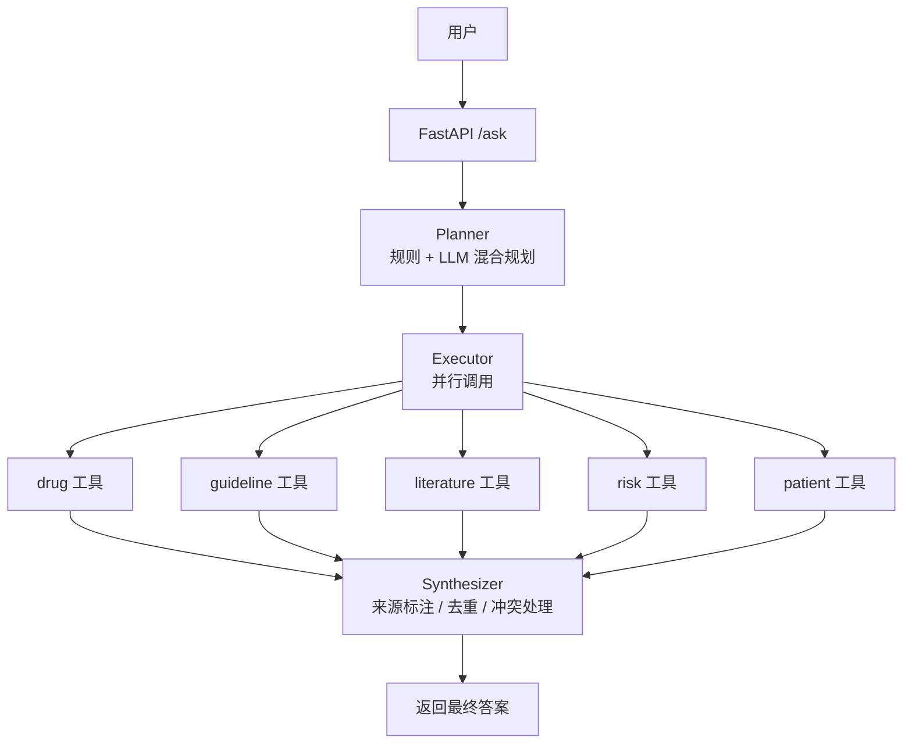

# 医疗 Agent — 基于 RAG 的多工具医学问答助手

## 项目简介

本项目是一个基于 **LangChain + FastAPI + Chroma** 构建的医疗领域智能问答 Agent。系统采用 **Planner-Executor-Synthesizer** 三层架构，能够并行调用药物、指南、文献、风险、患者档案等多个专业工具，提供准确、可溯源的医学信息回答。

## 技术栈

| 组件 | 技术 |
|------|------|
| Web 框架 | FastAPI + Uvicorn |
| LLM 服务 | 阿里云 DashScope (qwen-plus) |
| 嵌入模型 | text-embedding-v4 |
| 向量数据库 | Chroma (本地) |
| 关系数据库 | MySQL 8.0 |
| Agent 框架 | LangChain |
| 容器化 | Docker + Docker Compose |
| 监控 | Prometheus (指标暴露) |
| 日志 | RotatingFileHandler (日志轮转) |

## 核心功能

| 功能 | 描述 |
|------|------|
| **多工具协同问答** | 同时调用 drug/guideline/literature/risk 工具回答复杂问题 |
| **患者档案管理** | 记住、查询、追加患者信息，自动加载档案辅助决策 |
| **多轮对话记忆** | 理解“它”、“他”、“这个”等指代词，支持上下文对话 |
| **智能规划器** | 规则 + LLM 混合规划，自动选择最优工具组合 |
| **并行执行** | 多工具并行调用，响应时间缩短 70% |
| **缓存优化** | 智能缓存相同问题，减少重复 LLM 调用 |
| **流式输出** | 支持逐字显示（SSE），提升用户体验 |
| **重试降级** | API 失败自动重试，降级返回检索片段 |
| **监控运维** | Prometheus 指标暴露 + 日志轮转 + 健康检查 |

## 架构图



## 快速开始

### 1. 环境要求
- Python 3.10+
- Docker + Docker Compose (可选)
- 阿里云 DashScope API Key

### 2. 克隆项目
git clone https://github.com/Dillon-Xue/med_agent_v1.git
cd med_agent_v1

### 3. 配置环境变量

复制 `.env.example` 为 `.env` 并填写：

```bash
cp .env.example .env
```

编辑 `.env` 文件：

```env
# ============================================
# 阿里云 DashScope 配置
# ============================================
DASHSCOPE_API_KEY=sk-xxxxxxxxxxxxxxxxxxxxxxxx   # 你的百炼 API Key
DASHSCOPE_MODEL=text-embedding-v4               # 嵌入模型

# ============================================
# 项目路径配置
# ============================================
MED_AGENT_ROOT=/mnt/d/Agent/Med_Agent   # 向量库所在目录（本地运行）
# MED_AGENT_ROOT=/app                           # Docker 容器内使用

# ============================================
# LLM 模型配置
# ============================================
LLM_MODEL_NAME=qwen-plus                        # 对话模型
EMBEDDING_MODEL_NAME=text-embedding-v4          # 嵌入模型

# ============================================
# MySQL 数据库配置（患者档案存储）
# ============================================
DB_HOST=localhost                               # 数据库地址
DB_USER=root                                    # 数据库用户名
DB_PASSWORD=your_strong_password                # 数据库密码
DB_NAME=patient_db                              # 数据库名称
```


### 4. 配置向量库
#### 需要先将医药相关的PDF文档放入 data/{drug,guideline,literature,risk} 目录
python ingest.py

### 5. 启动服务
- 方式一：直接运行
pip install -r requirements.txt
uvicorn chat:app --reload

- 方式二：Docker 一键启动
docker-compose up -d

### 6. 访问前端
- 问答页面 http://localhost:8000/static/index.html 
- 接口文档 http://localhost:8000/docs  
- 状态检查 http://localhost:8000/health   
- 监控信息 http://localhost:8000/metrics   


