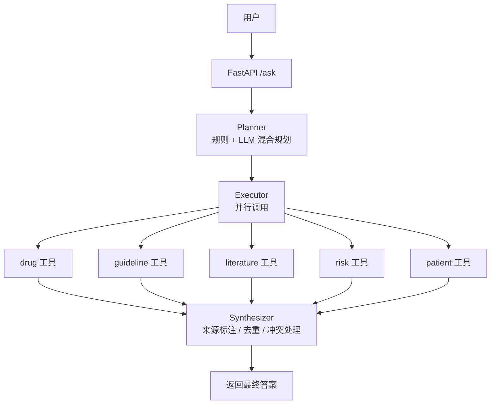

# 医疗 Agent — 基于 RAG 的多工具医学问答助手

## 项目简介

本项目是一个基于 **LangChain + FastAPI + Chroma** 构建的医疗领域智能问答 Agent。系统采用 **Planner-Executor-Synthesizer** 三层架构，能够并行调用药物、指南、文献、风险、患者档案等多个专业工具，提供准确、可溯源的医学信息回答。

## 技术栈

| 组件 | 技术 |
|------|------|
| Web 框架 | FastAPI + Uvicorn |
| LLM 服务 | 阿里云 DashScope (qwen-plus) |
| 嵌入模型 | text-embedding-v4 |
| 向量数据库 | Chroma (本地) |
| 关系数据库 | MySQL 8.0 |
| Agent 框架 | LangChain |
| 容器化 | Docker + Docker Compose |
| 监控 | Prometheus (指标暴露) |
| 日志 | RotatingFileHandler (日志轮转) |

## 核心功能

| 功能 | 描述 |
|------|------|
| **多工具协同问答** | 同时调用 drug/guideline/literature/risk 工具回答复杂问题 |
| **患者档案管理** | 记住、查询、追加患者信息，自动加载档案辅助决策 |
| **多轮对话记忆** | 理解“它”、“他”、“这个”等指代词，支持上下文对话 |
| **智能规划器** | 规则 + LLM 混合规划，自动选择最优工具组合 |
| **并行执行** | 多工具并行调用，响应时间缩短 70% |
| **缓存优化** | 智能缓存相同问题，减少重复 LLM 调用 |
| **流式输出** | 支持逐字显示（SSE），提升用户体验 |
| **重试降级** | API 失败自动重试，降级返回检索片段 |
| **监控运维** | Prometheus 指标暴露 + 日志轮转 + 健康检查 |

## 架构图



## 快速开始

### 1. 环境要求
- Python 3.10+
- Docker + Docker Compose (可选)
- 阿里云 DashScope API Key

### 2. 克隆项目
- git clone https://github.com/Dillon-Xue/med_agent_v1.git
- cd med_agent_v1

### 3. 配置环境变量

复制 `.env.example` 为 `.env` 并填写：

```bash
cp .env.example .env
```

编辑 `.env` 文件：

```env
# ============================================
# 阿里云 DashScope 配置
# ============================================
DASHSCOPE_API_KEY=sk-xxxxxxxxxxxxxxxxxxxxxxxx   # 你的百炼 API Key
DASHSCOPE_MODEL=text-embedding-v4               # 嵌入模型

# ============================================
# 项目路径配置
# ============================================
MED_AGENT_ROOT=/mnt/d/Agent/Med_Agent   # 向量库所在目录（本地运行）
# MED_AGENT_ROOT=/app                           # Docker 容器内使用

# ============================================
# LLM 模型配置
# ============================================
LLM_MODEL_NAME=qwen-plus                        # 对话模型
EMBEDDING_MODEL_NAME=text-embedding-v4          # 嵌入模型

# ============================================
# MySQL 数据库配置（患者档案存储）
# ============================================
DB_HOST=localhost                               # 数据库地址
DB_USER=root                                    # 数据库用户名
DB_PASSWORD=your_strong_password                # 数据库密码
DB_NAME=patient_db                              # 数据库名称
```

### 4. 配置向量库
#### 需要先将医药相关的PDF文档放入 data/{drug,guideline,literature,risk} 目录
python ingest.py

### 5. 启动服务
- 方式一：直接运行
pip install -r requirements.txt
uvicorn chat:app --reload

- 方式二：Docker 一键启动
docker-compose up -d

### 6. 访问前端
- 问答页面 http://localhost:8000/static/index.html 
- 接口文档 http://localhost:8000/docs  
- 状态检查 http://localhost:8000/health   
- 监控信息 http://localhost:8000/metrics   

# 项目结构说明

## 一、核心入口文件

| 文件 | 用途 |
|------|------|
| `chat.py` | **主入口**。FastAPI 服务启动文件，定义了 `/ask`、`/v1/ask`、`/health`、`/metrics` 等 API 端点。 |
| `ingest.py` | **向量库构建脚本**。读取 `data/` 目录下的 PDF 文档，切片后存入 Chroma 向量数据库。 |
| `app.py` | ⚠️ 已废弃，可安全删除。 |


## 二、`agents/` 目录（Agent 核心逻辑）

| 文件 | 用途 |
|------|------|
| `planner.py` | **规划器**。决定调用哪些工具，支持规则匹配 + LLM 混合规划。 |
| `executor.py` | **执行器**。并行调用工具，每个工具设置 10 秒超时，过滤 `None` 结果。 |
| `synthesizer.py` | **合成器**。综合多工具结果，来源标注、去重、冲突处理，生成最终答案。 |
| `llm_planner.py` | **LLM 规划器**。规则匹配不理想时，调用 qwen-plus 重新生成工具列表。 |


## 三、`tools/` 目录（工具实现）

| 文件 | 用途 |
|------|------|
| `base_tool.py` | **工具基类**。统一接口、向量库加载、OpenAI 客户端、重试与降级。 |
| `drug_tool.py` | **药物工具**。检索药品说明书，回答成分、适应症、副作用、用法。 |
| `guideline_tool.py` | **指南工具**。检索临床指南，回答治疗推荐、诊疗规范。 |
| `literature_tool.py` | **文献工具**。检索医学文献，回答机制研究、最新进展。 |
| `risk_tool.py` | **风险工具**。检索药物相互作用，回答不良反应、禁忌症、药物冲突。 |
| `patient_tool.py` | **患者档案工具**。管理患者信息（记住/查询/追加），MySQL 存储。 |
| `rag_tool.py` | **通用 RAG 工具**（备用），支持 query rewrite 和 rerank。 |
| `tool_registry.py` | **工具注册中心**。统一创建和管理所有工具实例。 |
| `__init__.py` | 标识 `tools/` 为 Python 包。 |


## 四、`utils/` 目录（工具函数）

| 文件 | 用途 |
|------|------|
| `config.py` | **配置管理**。从 `.env` 读取环境变量。 |
| `embeddings.py` | **嵌入类**。封装 DashScope `text-embedding-v4` 模型。 |
| `response.py` | **统一响应格式**。定义 `build_response` 函数。 |


## 五、`static/` 目录（前端资源）

| 文件 | 用途 |
|------|------|
| `index.html` | **聊天界面**。纯 HTML + JavaScript 多轮对话界面。 |


## 六、其他目录

| 目录 | 用途 |
|------|------|
| `vector_db/` | **向量库持久化目录**。不提交到 Git，通过 Docker volume 挂载。 |
| `logs/` | **日志目录**。日志轮转（10MB/文件，保留 5 个备份），不提交到 Git。 |
| `app/` | ⚠️ 已废弃，可安全删除。 |


## 七、配置文件

| 文件 | 用途 |
|------|------|
| `.env` | **环境变量**。存储 API Key、数据库密码、路径等，不提交到 Git。 |
| `.gitignore` | **Git 忽略文件**。排除 `.env`、`vector_db/`、`logs/`、`__pycache__/` 等。 |
| `dockerfile` | **Docker 镜像构建文件**。定义 Python 3.10 环境、安装依赖、启动命令。 |
| `docker-compose.yml` | **Docker Compose 编排**。定义 `medical-agent` 和 `mysql-patient` 两个服务。 |
| `requirements.txt` | **Python 依赖清单**。项目所需的所有 Python 包。 |
| `README.md` | **项目文档**。介绍项目、技术栈、架构图、快速开始、API 文档。 |
