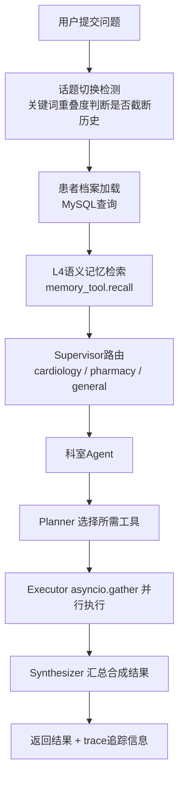
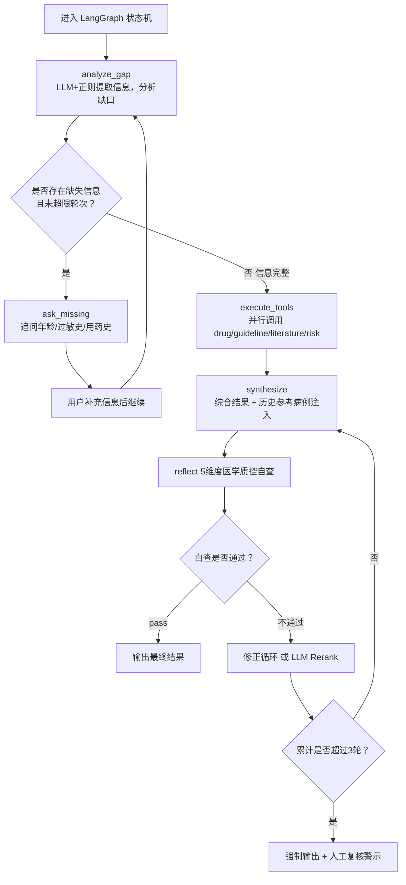
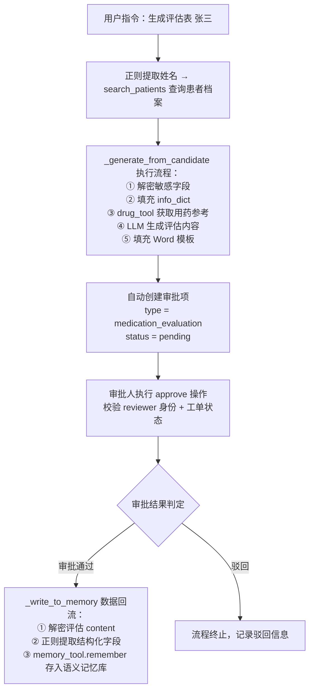
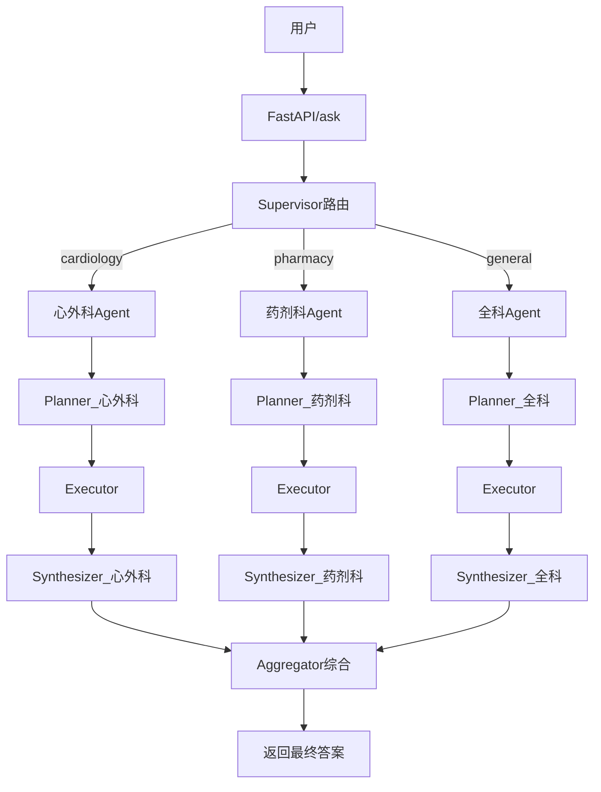
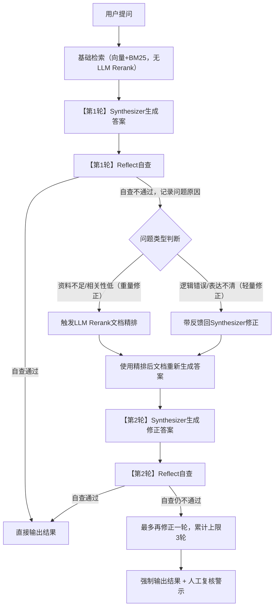

# 医生/患者的Agent助手

>一个能查药、问诊、自动生成病历、在线方案评审的智能医学平台

---

## 第一篇：背景概述

### 1.1 场景描述

上午10点，门诊医生王大夫正在看第15个病人。患者说：「我高血压，最近头疼，能吃布洛芬吗？」

王大夫需要打开**药品说明书系统**查布洛芬禁忌——3分钟。打开**临床指南库**查高血压用药建议——2分钟。再查**药物相互作用**——又2分钟。三个系统，七分钟过去了，后面还排着20个病人。

更糟的是，王大夫忙起来可能会忘了问：「您多大年龄？」「有没有药物过敏？」「目前在吃别的药吗？」——这三个问题，每一个都可能改变用药决策。

>这就是全国数万家医院每天都在上演的场景。这个项目的目标很简单：**把「七分钟+三个系统」变成「一句话+十秒钟」。**

### 1.2 能力概述

一个基于**RAG+LangGraph的多Agent协作医学问答平台**。医生只需要像跟同事说话一样，对着对话框输入问题，系统自动完成以下事情：

- **并行检索**药品说明书、临床指南、医学文献、药物相互作用库
- **综合所有来源**生成回答，每条信息标注出处
- **主动追问**缺失的患者信息（年龄、过敏史、用药史）
- **生成评估报告**并自动进入审批流程
- **沉淀经验**，审批通过的方案供后续相似病例参考

### 1.3 一句话总结

>把原来需要切换三四个系统、花几分钟才能查到的医学信息，变成一句自然语言对话，十秒内给出有据可查的答案。AI负责检索和初筛，人做最终决策。

### 1.4 适用场景

|场景|以前怎么做|现在怎么做|技术选择|
|------|-----------|-----------|----------|
|查药品/指南/文献|切换三四个系统分别查|一句话提问，自动并行查所有来源|Planner-Executor-Synthesizer|
|患者用药评估|凭经验口头问，易遗漏|系统自动分析缺口并追问|LangGraph多轮状态机|
|写评估报告|手写或复制粘贴，十几分钟|输入名字，自动生成Word报告|ReportTool+Word模板填充|
|审批用药方案|纸质签字，找人难|在线提交，审批人手机就能批|ApprovalTool+对话驱动|
|多科室会诊|分别咨询各科室|一次提问，心外/药剂/全科并行给出观点|Supervisor+Multi-Agent|
|参考历史病例|靠医生个人记忆|自动推荐相似病例的用药经验|L4语义记忆+数据回流|

### 1.5 技术栈

|组件|技术|选型理由|
|------|------|----------|
|Web框架|FastAPI+Uvicorn|原生异步、类型注解、Swagger自动生成|
|LLM|阿里云DashScope(qwen-plus)|中文医疗场景效果好、兼容OpenAIAPI|
|嵌入模型|text-embedding-v4|中文语义向量表现稳定|
|向量数据库|Chroma|轻量、本地可运行、适合PoC/MVP|
|关系数据库|MySQL8.0|成熟稳定，适合患者/审批等结构化数据|
|Agent框架|LangChain+LangGraph|工具抽象好、状态机适合多轮问诊|
|容器化|Docker+DockerCompose|一键部署、环境隔离、便于交付|
|监控|Prometheus|云原生标准、易于接入Grafana|

---

## 第二篇：需求分析

### 2.1 目标用户和场景

|用户|最头疼的事|系统帮他们做什么|
|------|-----------|-----------------|
|门诊医生|查药查指南要切三四个系统|一个对话框搞定所有查询|
|全科医生|怕漏问过敏史/用药史导致误判|系统自动分析缺口并追问|
|药剂师|大量用药方案需要审核|在线审批，手机就能操作|
|科室主任|审批流程纸质、找人难|自动提醒，在线通过/驳回|
|医院信息科|多科室共用，数据安全难保证|自带多租户隔离和加密|

### 2.2 功能需求

- **医学问答**：drug/guideline/literature/risk/patient多工具协同回答
- **智能问诊**：LangGraph主动追问缺失信息，生成个性化建议
- **患者档案**：记住/查询/追加患者信息，身份证号+手机号Fernet加密
- **评估表生成**：Word模板自动填充，输出.docx并支持在线预览
- **审批管理**：自动创建审批项，支持通过/驳回，对话驱动
- **文件解析**：图片/PDF上传，LLM提取患者信息并归档
- **多Agent协作**：Supervisor路由+心外/药剂/全科Agent并行+Aggregator聚合
- **数据回流**：审批通过后解密写入memory_tool语义记忆向量库

### 2.3 非功能需求

|需求|要求|实现方式|
|------|------|----------|
|准确性|回答基于检索资料，标注来源|RAG+来源标注+反思机制|
|响应速度|秒级|并行执行+SimpleCache+60s超时|
|数据安全|敏感字段加密，权限隔离|Fernet加密+tenant_id+doctor_id过滤|
|可审计|关键操作留痕|`audit_logs`表+`log_audit()`|
|可扩展|支持新增工具、科室Agent|`tool_registry.py`+`agent_factory.py`|
|可运维|健康检查、指标暴露、日志轮转|`/health`+`/metrics`+`RotatingFileHandler`|

### 2.4 三个核心痛点

**痛点一：信息查不全、查得慢。** 医生要打开三四个系统才能回答一个「能不能吃」的问题。业务上，这是效率杀手；技术上，这要求系统能 **并行调用多源异构工具**。

**痛点二：AI会「胡说八道」。** 大模型可能编造一个不存在的指南名称或药物剂量——医疗场景零容忍。技术上，这意味着必须用 **RAG约束回答范围+来源强制标注+反思自查**。

**痛点三：经验留不住。** 张医生治疗过的成功病例，李医生完全不知道。好的经验随人走。技术上，这需要 **审批通过后的数据回流机制**，将用药方案写入向量记忆库。

---

## 第三篇：方案与设计

### 3.1 核心思路：让AI当「助理」，人做「决策」

四个关键设计，每个解决一个具体问题：

#### ①查资料而不是编答案（RAG）

>**业务实现**：AI的回答不是「自己想出来的」，而是从药品说明书、临床指南、医学文献中检索出来的。每条信息后面都标着【来源：xxx】——就像论文的参考文献。如果找不到来源，就老老实实标【来源：模型推理，请核实】。

**代码设计**：
- `tools/rag_tool.py`+`tools/retriever.py`。采用Chroma向量库+BM25混合检索。
- `Synthesizer`的`system_prompt`强制要求只能使用工具返回的资料，禁止编造指南名称或期刊名称。
- 检索流程为：LLM查询改写（2-3个多角度查询）→向量检索（多查询召回去重）→BM25混合重排序（0.6×向量相似度+0.4×BM25）→反思触发LLMRerank。

#### ②一个大脑调度多个工具箱（Agent）

>**业务实现**：系统会自动判断问题需要查哪些资料——药品？指南？文献？冲突检测？——然后**同时**去查，不用一个一个来。就像一个医生同时派几个实习生分别去查不同的资料，然后汇总。

**代码设计**：
- `agents/planner.py`采用规则+LLM混合规划（规则快速低成本可解释，LLM兜底不确定场景）。
- `agents/executor.py`通过`asyncio.gather`并行执行多工具，60s超时兜底。
- `agents/synthesizer.py`综合各工具结果，根据`specialty`参数注入科室视角。

#### ③像经验丰富的医生一样追问（LangGraph）

>**业务实现**：系统不会拿到问题就直接回答。它会先分析：年龄知道吗？过敏史知道吗？在吃什么药？——如果信息不够，它会像医生一样追问，补全了再给出建议。

**代码设计**：`agents/consult_graph.py` 定义LangGraph状态机，节点流转：
analyze_gap（LLM+正则提取患者信息，分析年龄/过敏史/用药史缺口）
→ _should_ask_or_execute 逻辑判断
    ├→ 信息缺失且未超限 → ask_missing 追问补充信息 → 重回状态机开头
    └→ 信息完整 → execute_tools 执行检索
→ synthesize（综合工具结果 + 注入feedback修正信息）
→ reflect（医学质控5维度审核）
    ├→ 审核通过 → 输出回答
    └→ 审核不通过 → 修正循环或Rerank，最多迭代3轮，回到synthesize

#### ④多科室会诊（Multi-Agent）

>**业务实现**：同一个问题，心外科、药剂科、全科各给出自己的专业意见，最后汇总成一个综合建议——就像医院里的多学科会诊（MDT）。

**技术实现**：
- `agents/supervisor.py`通过LLM判断问题归属，路由到`cardiology`/`pharmacy`/`general`。
- `agents/agent_factory.py`为每个科室创建独立Agent（含带specialty参数的Planner和Synthesizer）。
- `agents/aggregator.py`聚合多科室观点，标注分歧。

### 3.2 系统架构

分层结构（自下而上）：

```
接入层：Web前端+飞书适配器
  ↓
接口层：FastAPI—/ask,/consult,/upload,/approvals,/history,/health,/metrics
  ↓
编排层：LangChain+LangGraph、Planner-Executor-Synthesizer、ConsultGraph状态机、Supervisor路由+Aggregator聚合
  ↓
工具层：drug/guideline/literatur/risk
  ↓
数据层：MySQL、Chroma向量库
```

**业务对照**：

|分层|业务对照|
|----|------|
|数据层|系统的「记忆」——存患者档案和医学知识|
|工具层|系统的「工具箱」——能查药、查指南、查文献、查冲突|
|编排层|系统的「大脑」——决定什么时候用什么工具，怎么整合结果|
|接口层|系统的「嘴巴和耳朵」——接收问题，给出回答|
|接入层|系统的「入口」——网页端和飞书都能用|

### 3.3 代码模块职责

```tree
med_agent_v1/
├──agents/
│├──planner.py#规则+LLM混合规划
│├──executor.py#异步并行执行
│├──synthesizer.py#LLM答案合成
│├──consult_graph.py#LangGraph智能问诊
│├──supervisor.py#多Agent路由
│├──agent_factory.py#科室Agent工厂
│├──aggregator.py#多Agent结果综合
│└──state.py#LangGraph状态定义
├──tools/
│├──base_tool.py#工具基类（重试+降级）
│├──drug_tool.py#药品说明书检索
│├──guideline_tool.py#临床指南检索
│├──literature_tool.py#医学文献检索
│├──risk_tool.py#药物相互作用检索
│├──patient_tool.py#患者档案CRUD
│├──report_tool.py#评估表生成+审批
│├──approval_tool.py#审批管理
│├──file_tool.py#文件解析
│├──retriever.py#混合检索（向量+BM25）
│├──memory_tool.py#L4语义记忆（V4.1）
│└──tool_registry.py#工具注册表
├──utils/
│├──config.py#LLM客户端工厂
│├──embeddings.py#DashScope嵌入
│├──response.py#统一响应格式
│├──crypto.py#敏感数据加密
│└──audit.py#审计日志
├──tests/#单元测试
│├──conftest.py#Mock夹具
│├──test_planner.py#18个用例
│├──test_executor.py#4个用例
│├──test_synthesizer.py#7个用例
│├──test_retriever.py#4个用例
│└──test_base_tool.py#重试降级用例
├──static/
│└──index.html#前端SPA
├──feishu_adapter.py#飞书适配层（V4.0.1）
├──chat.py#FastAPI主入口
├──ingest.py#向量库构建
├──init.sql#数据库建表
├──dockerfile#集成测试
├──docker-compose.yml
├──requirements.txt#含pytest依赖
└──README.md
```
### 3.4 核心流程与技术

#### 快速问答（/ask）

#### 智能问诊（/consult）


#### 评估表+审批+数据回流


#### V4多Agent协作架构


#### 反思循环逻辑


### 3.5 知识库搭建

- **外部知识**：药品说明书、临床指南、医学文献PDF→`ingest.py`解析→DashScopeEmbedding向量化→Chroma向量库
- **内部经验**：审批通过的用药方案→`_write_to_memory`→写入memory_tool语义记忆向量库
- **检索策略**：LLM查询改写→向量检索去重→BM25混合重排序→LLMRerank兜底
- **知识更新**：新PDF放入data/目录→重新运行`ingest.py`

### 3.6 安全设计

|层面|方案|实现|
|------|------|------|
|加密|Fernet对称加密，id_card、phone加密存储，密钥环境变量注入|`utils/crypto.py`|
|多租户|X-Tenant-IDHeader+ContextVar注入，SQL同时过滤tenant_id和doctor_id|`chat.py`、`patient_tool.py`、`approval_tool.py`|
|审计|记录QUERY/UPDATE/CREATE/APPROVE/REJECT，detail经mask_sensitive脱敏|`utils/audit.py`→`audit_logs`表|
|权限|审批校验reviewer==current_user，report_tool校验doctor_id匹配|`approval_tool.py`、`report_tool.py`|

---

## 第四篇：输出质量保障

### 4.1 怎么保证不出错

>医疗场景最怕AI「一本正经地胡说八道」。本项目用了三重保障：第一，所有回答必须有据可查，找不到来源就老实标注；第二，系统在给出答案前会自动自查五遍；第三，用药方案必须人工审批才能生效。

#### 三重保障机制

**第一重：RAG约束+来源标注。**
- `Synthesizer`的`system_prompt`强制要求只能使用工具返回的资料，每条信息末尾标注【来源：xxx】，无法对应时标注【来源：模型推理，请核实】。

**第二重：反思机制。**
`consult_graph.py`的`reflect`节点从5个维度审核答案：
- 1.资料充分性：检索到的资料是否足够支撑回答？
- 2.绝对禁忌：是否推荐了患者明确禁用的药物？
- 3.准确性：剂量、用法、诊断逻辑是否准确？
- 4.完整性：是否遗漏了重要的警示信息？
- 5.幻觉风险：是否编造了不存在的来源或事实？

不通过则进入修正循环或触发LLMRerank，`max_iterations=3`。

**第三重：人工审批。**
评估表生成后自动创建审批项，必须经审批人通过才能生效。反思不通过时强制标记「请人工复核」。

### 4.2 测试覆盖

|模块|用例数|验证内容|
|------|--------|----------|
|`test_planner.py`|18|规则匹配、LLM规划、患者/审批/评估表指令识别、specialty参数|
|`test_executor.py`|4|asyncio.gather并行、60s超时、异常兜底|
|`test_synthesizer.py`|7|答案合成、来源标注、report/patient优先返回、降级处理、specialty注入|
|`test_retriever.py`|4|query_rewrite、向量检索、BM25重排、去重逻辑|
|`test_base_tool.py`|-|重试+降级逻辑|
|集成测试|4套|/ask+/consult端到端、审批流程、审计日志、患者档案CRUD|

运行方式：`PYTHONPATH=.pytesttests/-v`，覆盖率：`pytesttests/--cov=agents--cov=tools--cov-report=html`

### 4.3 使用前后对比

|业务环节|用之前|用之后|
|------|------|------|
|查医学资料|切换三四个系统，3-5分钟|一句话，十秒|
|收集患者信息|口头问，容易漏|LangGraph自动分析+追问|
|写评估报告|手写/复制粘贴，10-15分钟|模板自动生成，<1分钟|
|审批方案|纸质签字，找人难|在线创建+通过/驳回，分钟级流转|
|经验沉淀|靠人记|审批通过→自动写入记忆库|
|数据安全|无加密无隔离|Fernet加密+多租户+审计|

---

## 第五篇：交付与运维

### 5.1 版本迭代

|版本|交付内容|验收标准|
|------|----------|----------|
|V1快速问答|Planner-Executor-Synthesizer+drug/guideline/literature/risk|多工具协同回答5类医学问题|
|V2智能问诊|LangGraphConsultGraph+analyze_gap/ask_missing/execute_tools/synthesize|主动追问+生成用药建议|
|V3生产就绪|结构化患者档案、评估表生成、自动审批、会话持久化、Fernet加密|通过安全评审和集成测试|
|V4多Agent|Supervisor路由、心外/药剂/全科Agent、反思LOOP、飞书对接、语义记忆|心外/药剂/全科并行协作|

### 5.2 部署

```bash
#本地运行
pipinstall-rrequirements.txt
#配置.env（DASHSCOPE_API_KEY、数据库密码、CRYPTO_KEY等）
uvicornchat:app--reload

#Docker一键部署（自动启动MySQL+medical-agent+ollama+feishu-adapter）
docker-composeup-d
```

### 5.3 运维要点

- **监控**：Prometheus`/metrics`采集请求数/延迟/错误数，按租户拆分，可接Grafana
- **日志**：`RotatingFileHandler`（10MB/文件，5备份），含tenant_id，`LOG_LEVEL`可调
- **备份**：MySQLDockerVolume定期快照；Chroma直接复制`vector_db`目录
- **故障处理**：常见问题见表

|故障|原因|处理|
|------|------|------|
|/ask超时|LLM响应慢或工具阻塞|检查APIKey/网络/超时日志|
|检索无结果|vector_db未构建|运行`ingest.py`|
|患者查不到|tenant_id/doctor_id不匹配|检查身份声明和请求头|
|审批列表空|非审批人|确认current_session_user==reviewer|
---

### 5.4 后期维护（部分能力暂未实现）

- **知识更新**：新PDF→`data/`目录→重新`ingest.py`
- **模型迭代**：收集线上案例→构建评测集→优化prompt/检索权重
- **反馈收集（未实现）**：前端👍/👎+trace_id关联，分析高频错误
- **数据清理**：定期清理过期会话/无效审批，清理前备份，低峰期执行


## 第六篇：价值评估

### 6.1 带来的改变

|维度|具体改变|
|------|----------|
|效率|单次查询从3-5分钟→10秒；评估报告从10-15分钟→<1分钟；并行执行缩短响应约70%|
|质量|RAG+来源标注+反思+人工审批，四重保障降低用药错误风险|
|成本|SimpleCache减少冗余LLM调用；ollama本地模型切换降低云端成本|
|沉淀|审批通过的用药方案自动写入记忆库，组织知识从「人脑记忆」变为「系统资产」|

### 6.2 投入产出

- **投入**：1名FDE约2-3个月（V1-V4），DashScopeAPI按请求量计费，服务器资源
- **产出**：20名医生×30min/天=年省约2,500工时，按医生时薪折算，**6-12个月收回投入**
- **长期价值**：少一次用药错误、少一个漏诊、多一个可复用的经验——这些价值无法用短期ROI衡量

---

## 附录A：项目技术角度分析

### A.1 技术亮点

|亮点|一句话|关键代码|
|------|--------|----------|
|多Agent协作|Supervisor路由+心外/药剂/全科Agent并行+Aggregator聚合，模拟MDT|`agents/supervisor.py`、`agent_factory.py`、`aggregator.py`|
|LangGraph状态机|问诊→缺口分析→追问→执行→合成→反思闭环|`agents/consult_graph.py`|
|混合检索|向量+BM25+查询改写+LLMRerank四阶段优化|`tools/retriever.py`|
|反思机制|5维度医学质控，最多3轮自动修正|`consult_graph.py`reflect节点|
|数据回流|审批通过→解密→写入记忆向量库，组织知识持续积累|`approval_tool.py`_write_to_memory|

### A.2 设计取舍

|决策|选择|原因|
|------|------|------|
|ChromavsES|Chroma|PoC/MVP阶段需轻量本地，数据量增大可迁移|
|云端vs本地模型|默认qwen-plus，支持ollama切换|兼顾效果和成本，`get_llm_client`统一切换|
|规则vsLLMPlanner|混合|规则快速低成本可解释，LLM兜底不确定场景|